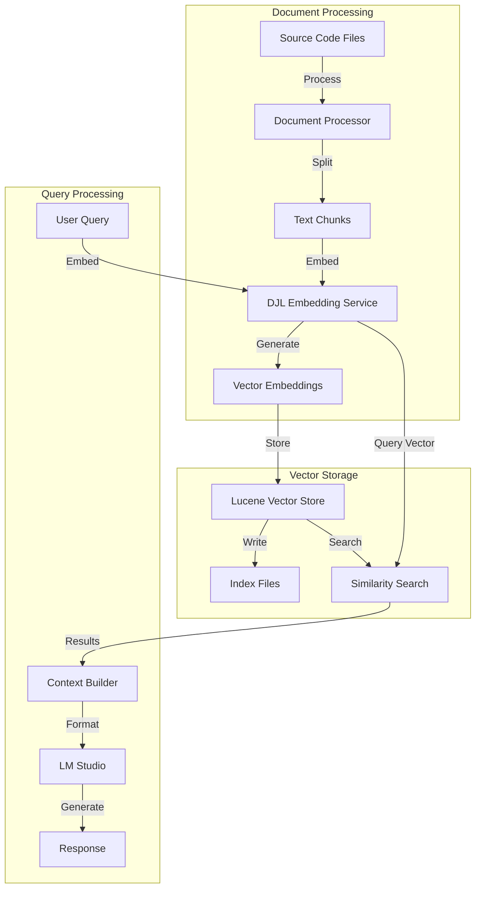
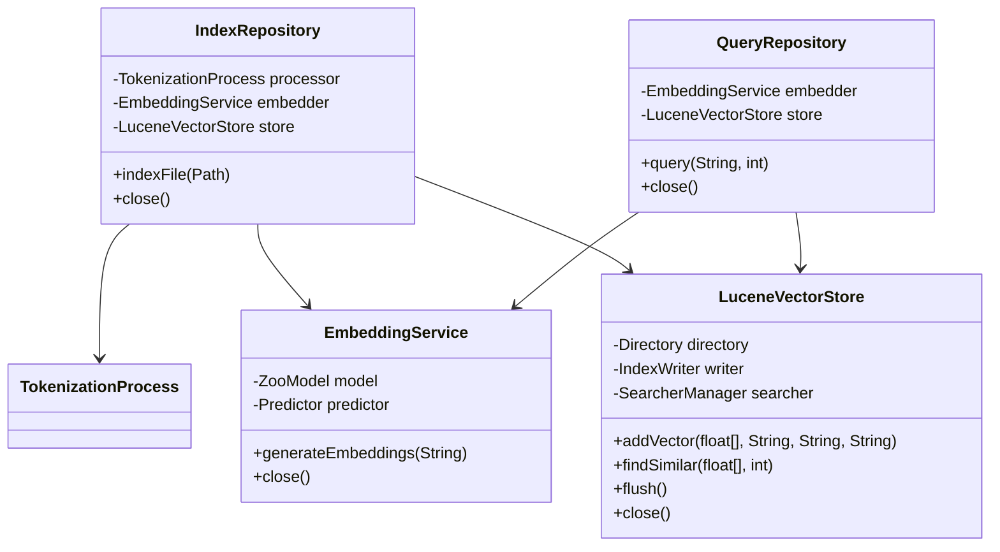
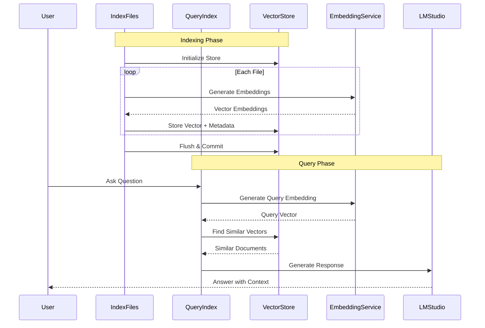

# Local RAG System - Architecture Reference Book

## Table of Contents
1. [System Overview](#system-overview)
2. [Architecture Components](#architecture-components)
3. [Data Flow](#data-flow)
4. [Component Design](#component-design)
5. [Storage Design](#storage-design)
6. [Integration Points](#integration-points)
7. [Performance Considerations](#performance-considerations)
8. [Security Considerations](#security-considerations)

## System Overview

The Local RAG (Retrieval-Augmented Generation) System is designed to provide intelligent code-aware responses by combining local vector storage, embedding generation, and language model inference. The system operates entirely locally, ensuring data privacy and reducing latency.

### High-Level Architecture

## Architecture Components

### Core Components Class Diagram

### Component Descriptions

1. **Tokenization Process**
   - Handles file reading and chunking
   - Implements size limits and overlap
   - Filters files based on extensions
   - Manages memory usage during processing

2. **Embedding Service**
   - Uses DJL (Deep Java Library)
   - Loads all-MiniLM-L6-v2 model
   - Generates 384-dimensional embeddings
   - Handles text normalization

3. **Lucene Vector Store**
   - Persistent vector storage
   - Append-only operations
   - Batched commits
   - Similarity search using cosine distance

4. **Query System**
   - Interactive interface
   - Conversation history management
   - Context building
   - Response formatting

## Data Flow

### Sequence Diagram

## Storage Design

### Vector Store Structure
- Uses Apache Lucene for persistence
- Compound file format for better I/O
- Normalized vectors for accurate similarity
- Metadata storage alongside vectors

### Index Organization
1. **Fields**
   - `vector`: Binary-encoded float array
   - `id`: Unique document identifier
   - `content`: Text content
   - `source`: Source file information

2. **Commit Strategy**
   - Batch size: 1000 documents
   - RAM buffer: 256MB
   - Periodic flush intervals
   - Commit-on-close guarantee

## Integration Points

### External Systems
1. **LM Studio Integration**
   - REST API communication
   - Local inference server
   - Configurable host/port
   - Error handling and retry logic

2. **DJL Integration**
   - Model loading from HuggingFace
   - PyTorch engine backend
   - Configurable model options
   - Resource management

## Performance Considerations

### Indexing Performance
1. **Batch Processing**
   - Configurable batch sizes
   - Memory-efficient chunking
   - Parallel processing capability
   - Progress monitoring

2. **Resource Management**
   - Memory usage controls
   - File size limits
   - Buffer size optimization
   - Garbage collection hints

### Query Performance
1. **Search Optimization**
   - In-memory searcher
   - Vector normalization
   - Similarity thresholds
   - Result caching

2. **Response Time**
   - Async query processing
   - Configurable result limits
   - Prioritized searching
   - Context optimization

## Security Considerations

### Data Protection
1. **Local Processing**
   - All data stays on local machine
   - No external API dependencies
   - Configurable data directories
   - Access control via file system

2. **Model Security**
   - Local model storage
   - Verified model downloads
   - No remote inference
   - Configurable model paths

### Configuration Security
1. **Environment Variables**
   - Sensitive data in .env
   - Configuration validation
   - Default safe values
   - Path sanitization

2. **Runtime Security**
   - Resource limits
   - Input validation
   - Error handling
   - Secure cleanup

## Deployment Guide

### Prerequisites
- Java 17+
- Maven 3.8+
- 16GB RAM recommended
- SSD storage recommended

### Installation Steps
1. Clone repository
2. Configure environment
3. Build with Maven
4. Verify installation
5. Run indexer
6. Start query system

### Monitoring
- Log file locations
- Performance metrics
- Health checks
- Error tracking

## Future Considerations

### Scalability
- Distributed indexing
- Shared vector stores
- Load balancing
- Caching layers

### Enhancements
- Additional embedding models
- Alternative vector stores
- Enhanced preprocessing
- Advanced querying 